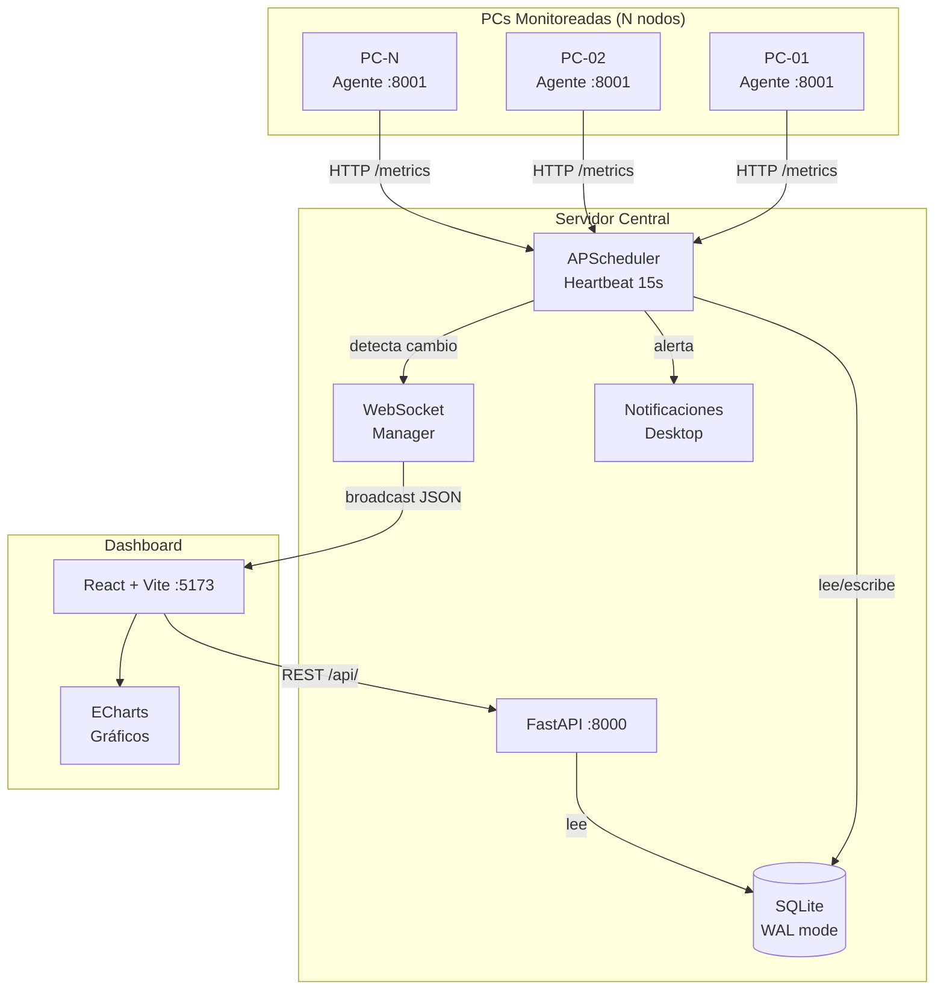

# Arquitectura — PC Monitor v2.0

## Diagrama de componentes



## Flujo de datos

### 1. Heartbeat (cada 15 segundos)
```
Scheduler → GET http://[ip]:8001/metrics → agente
  ├── OK: guardar Metric en DB, broadcast metrics_update por WS
  │    └── Si estaba offline: guardar Event "online", broadcast event
  └── Error: marcar offline en DB, broadcast event "offline", notificación desktop
```

### 2. Dashboard se conecta
```
Browser → WebSocket ws://localhost:8000/ws
  └── Servidor responde: initial_state {pcs: [...], events: [...]}
  └── Luego recibe mensajes en tiempo real sin polling
```

### 3. Registro de nueva PC
```
Dashboard → POST /api/pcs {ip, name}
  └── Servidor intenta GET http://[ip]:8001/info para obtener hostname/OS
  └── Guarda PC en DB
  └── Broadcast pc_registered a todos los dashboards conectados
```

## Decisiones de diseño

### ¿Por qué FastAPI en lugar de Flask?
- **Async nativo**: el scheduler corre en background sin bloquear
- **WebSockets integrados**: sin librerías extras
- **Pydantic**: validación automática de request bodies
- **Docs automáticas**: `/docs` con Swagger UI

### ¿Por qué SQLite + WAL en lugar de PostgreSQL?
- El sistema corre en red local sin infraestructura de nube
- WAL (Write-Ahead Log) permite lecturas concurrentes mientras se escribe
- Para 200 PCs × 15s = ~13 escrituras/minuto — SQLite es más que suficiente
- Migración a PostgreSQL/TimescaleDB es straightforward si se necesita

### ¿Por qué APScheduler en lugar de celery?
- No requiere Redis ni broker externo
- Se integra directamente en el proceso FastAPI
- `BackgroundScheduler` + `asyncio.run_coroutine_threadsafe` para thread safety

### ¿Por qué ECharts en lugar de Recharts/Chart.js?
- 10x más rápido con grandes datasets (canvas renderer)
- Soporta hasta 100k puntos sin lag
- Mejor soporte para temas dark
- Más tipos de gráficos disponibles
